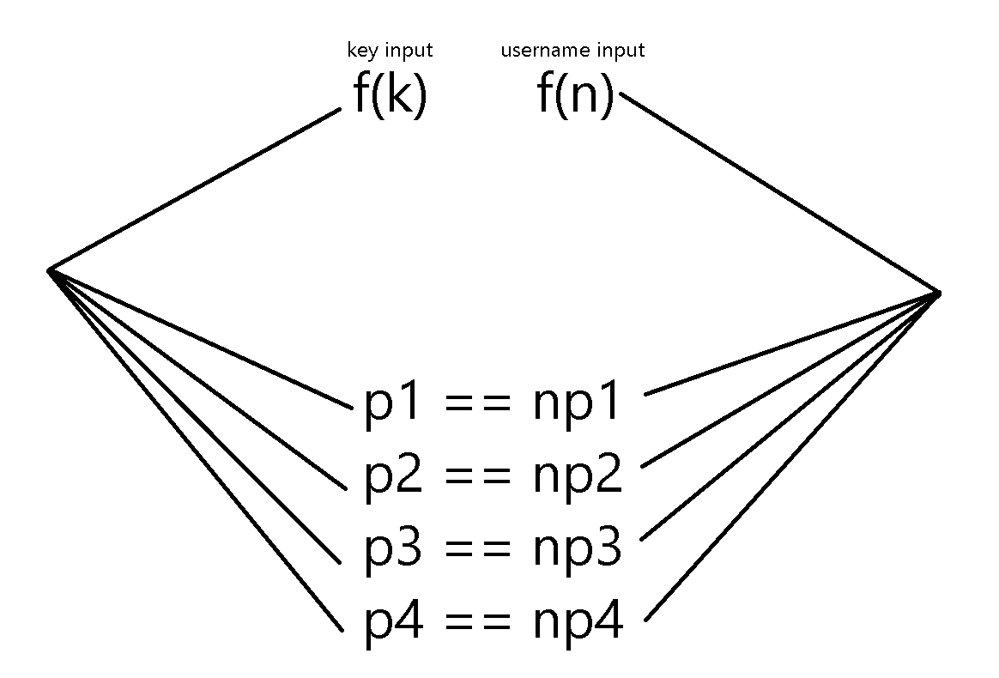

# SchoolBell-Keygen

This repository contains a proof of concept for a key generator targeting the SchoolBell application by ktims.com. SchoolBell is designed to manage school bell systems, and this key generator serves as an educational tool to demonstrate key generation techniques.

The purpose of this project is to provide insights into the mechanisms of software licensing and security. It is intended strictly for educational use and not for circumventing the purchase of legitimately licensed software. Users are encouraged to respect the software’s licensing agreement and to purchase a license if they choose to use the product.

A valid activation code alongside the username is found in the validuserkey.txt file to immediately activate without brute-forcing.

# How it works

Schoolbell transforms the key and username inputted and compares the two with a few parameters.

```
f(k) == f(n)
```

The key is sliced and gets 4 parameters taken out of it p1, p2, p3, p4.
These are then compared against the username parameters named np1, np2, np3 and np4.



For the software to activate 2 checks must be made.
The last 2 characters of the transformed key are taken as a checksum for the rest of the key and the checksum should match the last 2 hex values of the ascii sum of the first 14 characters of the transformed key. And the second condition is for the np1-4 values to match the p1-4 values.

The username is transformed to the below np1-4 values, with np3 always being 10.

```
np1 = (10 + strlen(username)) & 0xF
np2 = (ascii_sum(username)) & 0xFF
np3 = ascii_sum("Schoolbell")
np4 = np2 + 39
```
```
p1 = transformed_keyinput[0]

p2 = transformed_keyinput[1]
p2 = transformed_keyinput[2]

p3 = transformed_keyinput[3]

p4 = transformed_keyinput[4]
p4 = transformed_keyinput[5]
```


Since p1-4 are key values this makes it pretty simple to brute force a key, since we only need to match the np3 and np4 values, this gives us a big windows for key generation.
With bruteforce.py it finds keys that have the np3 as 10 and np4 as whatever np2 is + 39.
We use checksumfix to fix the checksum at the end by iterating ascii values and we have a valid key.
Now we produce a bunch of keys and try to find a key that matches a username. This can be automated as well but i chose not to do it.
We can use usernametokey to check our valid key list to match any usernames we put in. 
If there's no output, that means it couldn't find a correct key for it.

### An example would be:

```
Enter name: GuardianN06
Code found for username: MPSRQMYKKJQCMZPL

Transformed key: 51FA46FBF3D0B947
Checksum: 47

key: 208.03.4031

p1=5 np1=5
p2=31 np2=31
p3=10 np3=10
p4=70 np4=70
```

Or with the username "CRACKED" in validuserkey.txt

Some enhancements can be made to the scripts.
